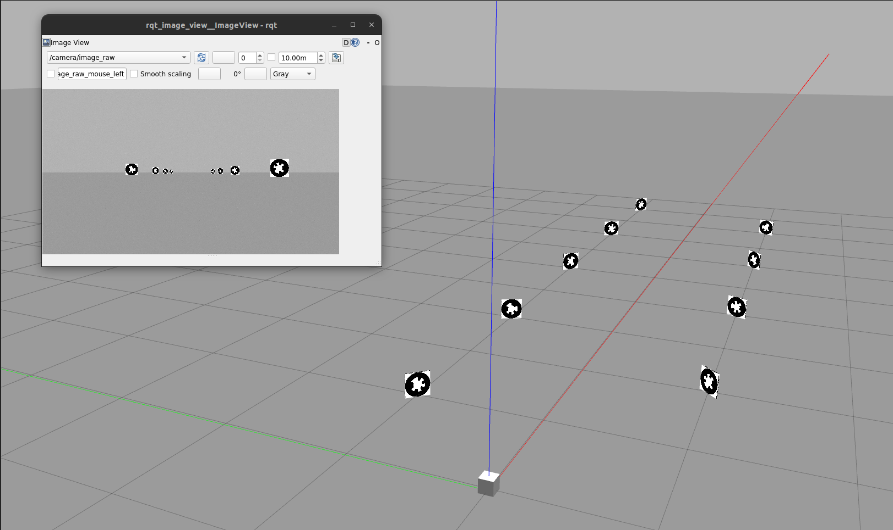
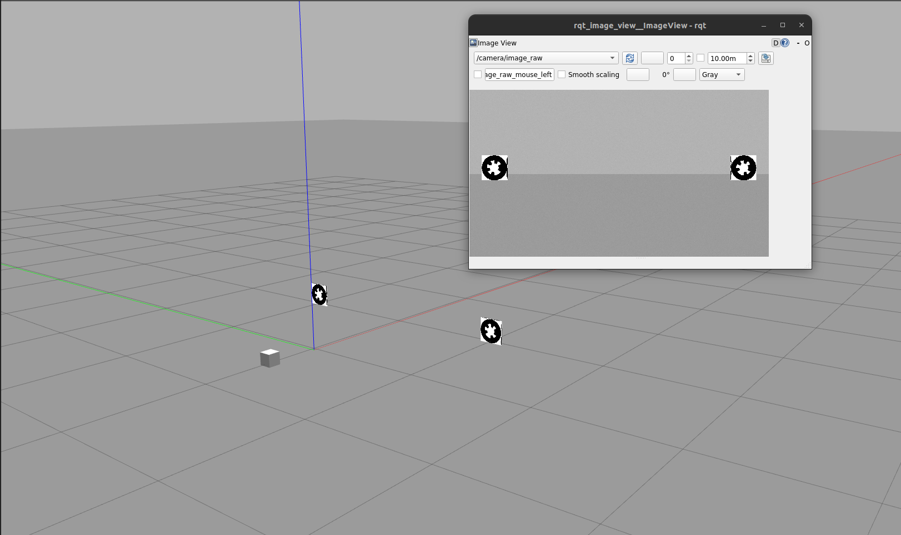

# Fiducial Gazebo Simulation Package

This package provides a very minimal Gazebo Harmonic (ros_gz_sim) simulation environment for fiducial marker localization and camera movement. It is designed for quick testing of marker detection algorithms and robot-camera control in a reproducible, configurable setting, with minimal dependencies and setup.

## Features
- Simulates up to 9 fiducial markers (WhyCode_1 to WhyCode_9) in customizable world layouts
- Includes a camera robot with planar movement, controlled via `cmd_vel` and publishing ground truth odometry
- Easily switch between different marker arrangements using launch file arguments
- All marker models and camera URDF are fully editable and extensible

## Usage

1. **Build the workspace:**
   ```bash
   cd ~/whycode-bench/workspace
   colcon build --packages-select fiducial_gazebo_sim
   source install/setup.bash
   ```
2. **Launch the simulation (ROS 2 + Gazebo Harmonic):**
   ```bash
   ros2 launch fiducial_gazebo_sim main.launch.py world:=docking.world
   ```
   Replace `world:=docking.world` with another filename from the `worlds/` directory, e.g. `whycode_1.world` or `whycode_2.world` to load different marker arrangements.

3. **Control the camera:**
   Use any standard teleoperation package, such as `teleop_twist_keyboard`, to control the camera:
   ```bash
   ros2 run teleop_twist_keyboard teleop_twist_keyboard cmd_vel:=/cmd_vel
   ```
   The camera will move in the plane and publish ground truth odometry to `/odom_ground_truth`.


## Adding More Markers
- To add more markers, create new directories in `fiducial_gazebo_sim/models/` (e.g., `WhyCode_10`) and copy the structure from an existing marker.
- Update the internal names and references in `model.config`, `model.sdf`, and material files.
- Add the marker to your world file by including it with a unique pose.

## Customizing Marker Positions
- For different marker positions or arrangements, simply make a copy of an existing world file (e.g., `whycode_1.world`) and adjust the `<pose>` fields for each marker as needed. You can create as many world files as you like and select them at launch using the `world` argument.

## Available Settings
- **World selection:** Pass `world:=<filename>` to the launch file to choose which marker arrangement to load.
- **Camera movement:** Controlled via `/cmd_vel` (bridged to Gazebo); odometry published to `/odom_ground_truth`.
- **Marker size:** Edit the `<size>` tag in each marker's `model.sdf` to change dimensions.
- **Friction:** Camera friction is set to zero for sliding; adjust in the SDF if needed.

## Example Worlds
Below are example images of two world layouts:

**World 1:**


**World 2:**


