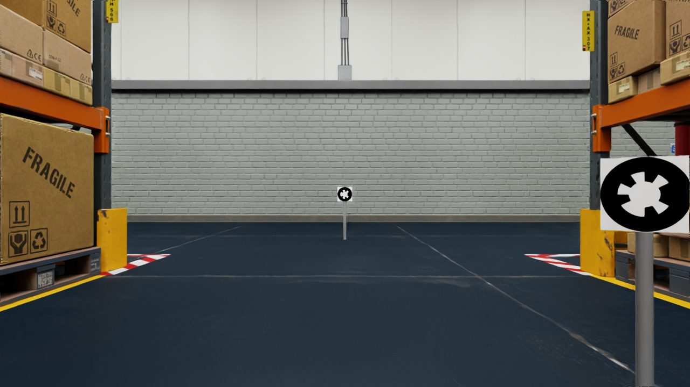
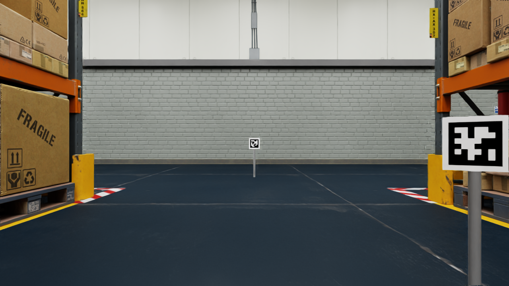
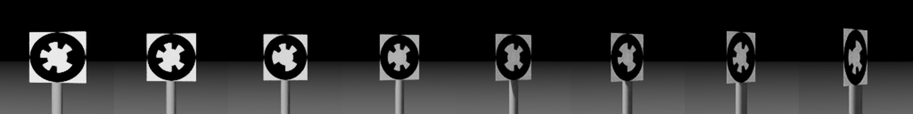

# whycode_sim

Isaac Sim warehouse benchmark scene for WhyCode and AprilTag detection.

A Nova Carter drives a fixed loop between warehouse racks past fiducial markers, while the
camera stream, robot odometry and **exact ground-truth marker poses** are recorded to a
bag. The bag is then replayed against detector variants offline.

| WhyCode | AprilTag |
|---|---|
|  |  |

The same camera pose in both runs, 5.60 m from the end-of-lane marker at 27 px. Marker
placement, path and viewing angles are derived from one config, so switching
`marker.family` re-textures the scene and changes nothing else.

Two things make the bag useful:

- **Ground truth in the detector's frame.** `/marker_ground_truth` gives each marker's true
  pose relative to the camera in the same convention `whycode_vision` publishes, so
  comparison is a subtraction.
- **A marker-family switch.** `marker.family: whycode | apriltag` re-textures every marker
  and leaves the path, poses and viewing angles identical.

## Quick start

```bash
./scripts/manage.sh start isaac      # first run streams ~20 GB of assets, 20-40 min
./scripts/manage.sh exec             # shell in the ROS container
```

Inside the ROS container:

```bash
colcon build --symlink-install --packages-select whycode_sim_msgs whycode_sim
source install/setup.bash
python3 src/whycode_sim/whycode_sim/scripts/check_camera.py    # see below -- do not skip
ros2 launch whycode_sim sim.launch.py record:=true bag_prefix:=/root/data/loop
```

**Check the camera before a long recording.** A stalled render product still publishes
`/camera/image_raw` at the right rate, size and encoding, with every pixel zero. Ground
truth, odometry and TF stay perfect, and zstd packs the all-black result small enough that
the bag size looks unremarkable, so nothing catches it except opening an image.
`check_camera.py` samples a dozen frames and exits non-zero if they are black or frozen,
so it can gate the recording. The usual cause is a simulator container that came up
`unhealthy`; recreate it with `docker compose --profile isaac rm -sf isaac` and start again.

`ISAAC_HEADLESS` in `.env`: `1` headless (default), `0` WebRTC livestream, `x11` native
window.

## Replaying a bag in RViz

**Stop the simulator first.** A running Isaac and a bag player both publish `/clock`; time
then jumps backwards, RViz resets on every jump, and the image and TF flicker before RViz
dies. It looks like a corrupt bag and is not.

```bash
./scripts/manage.sh clean            # stops the sim and every ROS process, then verifies
./scripts/manage.sh exec
```

Then, inside the container:

```bash
source /root/workspace/install/setup.bash
ros2 launch whycode_sim replay.launch.py bag:=/root/data/warehouse_loop rate:=2.0
ros2 launch whycode_sim replay.launch.py bag:=/root/data/apriltag_loop  rate:=2.0
```

`rate:=2.0`, not the default 1.0: the recording ran at about half real time, so playing it
back at 1.0 re-enacts that and delivers ~15 images per real second. 2.0 restores the 30 fps
a live run would have shown. Run `clean` between the two bags -- two players on `/clock` is
the flicker-and-crash case above.

`clean` exits non-zero if anything survives, so it can gate the replay:

```bash
./scripts/manage.sh clean && ./scripts/manage.sh exec
```

### Launch arguments

| Argument | Default | Meaning |
|---|---|---|
| `bag` | `/root/data/warehouse_loop` | Bag directory to replay |
| `rate` | `1.0` | Playback speed. `1.0` reproduces the recorded wall clock; see below |
| `loop` | `true` | Restart at the end. Each restart resets RViz; `false` to inspect |
| `rviz` | `true` | Open RViz |
| `marker_size_m` | `0.2` | Marker edge length, for drawing plates at the right size |

`rate` is in wall-clock terms, not simulation terms. rosbag2 replays each message at the
real-world moment it was recorded, and Isaac needed roughly two real seconds per simulated
second on this hardware -- so 115.8 s of simulation took 222.6 s to write, and `rate:=1.0`
faithfully re-enacts that slow session at ~15 images per real second.

Nothing is lost either way. Header stamps and `/clock` carry a strict 30 Hz, spaced a clean
1/30 s apart with no gaps, and that is what the detector and any offline analysis read.
Playback speed only changes how fast frames reach your eyes. On faster hardware the
recording would run nearer real time and `rate:=1.0` would already look right.

Do not trust `ros2 topic hz /camera/image_raw` here. It is a Python subscriber and cannot
keep up with 2.8 MB messages -- measured at 0.76 Hz on a stream a deep-queue subscriber
received at 15.3 Hz wall / 30.00 Hz sim. It reads lower still when RViz is already
subscribed to the same topic.

### What the displays show

`ground_truth_viz_node` converts the custom ground-truth message into RViz markers, on two
topics so world-frame geometry can be hidden from the camera overlay.

| Display | Topic | Shows |
|---|---|---|
| Camera image | `/camera/image_raw` | Raw feed, what the detector consumes |
| Camera | `/camera/image_raw` | Same feed with ground-truth plates overlaid in 3D |
| Ground truth (camera) | `/marker_ground_truth_viz` | Plates and labels at the reported pose |
| Layout and trail (world) | `/marker_layout_viz` | Static marker layout, camera path |
| TF | `/tf`, `/tf_static` | `World -> camera_link`, `World -> chassis_link -> base_link` |
| Odometry | `/odom_ground_truth` | Robot pose arrows along the loop |

Labels read `id<N> <range>m <pixels>px <angle>deg`. Plate colour says why a marker is not
counted visible, which is the question that comes up when a detection is missing:

| Colour | Meaning |
|---|---|
| green | visible, the detector should find it |
| grey | not in frame |
| red | in frame, occluded |
| purple | in frame, too oblique |
| yellow | in frame and facing, too few pixels |

**The check worth doing:** in the Camera display, green plates should sit on the printed
markers in the image. Offset or on the wrong axis means the frame convention is wrong.

Fixed frame is `World`. Camera-frame markers are stamped zero so RViz uses the latest
transform; the ground-truth stamp can sit slightly ahead of the newest TF, and the lookup
then fails as an extrapolation with nothing drawn.

## Configuration

Everything is in `config/scene.yaml`, read by the scene builder, the ground-truth node and
the waypoint follower, so placement is computed once and cannot drift.

| Key | Controls |
|---|---|
| `camera.width/height/fps/hfov_deg` | Resolution, frame rate, field of view |
| `camera.mount` | Camera pose on the chassis, robot body frame |
| `marker.family` | `whycode` or `apriltag`; swaps every marker |
| `marker.families` | Per-family texture list and decoded ids |
| `marker.size_m` | Marker edge length; **coupled to the detector's `outer_diameter`** |
| `marker.height_m` | Marker centre height; defaults to camera height |
| `marker.facing_angle_deg` | Marker tilt toward oncoming traffic; see below |
| `marker.emissive_intensity` | Marker brightness, a calibration knob |
| `visibility.*` | Thresholds for the `visible` flag |
| `path.*` | Waypoints, speed, lookahead, yaw-rate limit |
| `markers` | Placement slots: waypoint, distance along, side, offset |

Thirteen markers: nine alongside the path alternating left and right, plus one at the end
of each of the four straights, a metre past the corner and square to the lane. The
end-of-lane four are the long-range samples -- the robot drives at them head-on for the
whole approach, so they sweep apparent diameter from below the decode floor up to ~120 px
(measured: 15 px at 10.2 m, 27 px at 5.6 m, 116 px at 1.3 m, all under 10 deg incidence).

Marker orientation is derived, not authored. `facing_angle_deg` is the incidence a robot
sees approaching from far up the path, applied against the local path heading and the side
the marker sits on, so left and right stay symmetric (verified to machine precision by the
geometry self-checks).

**It is set to 30, chosen by measurement.** Sweeping 15-90 deg over the actual loop:

| facing | detectable frames | good-quality frames | median incidence |
|---|---|---|---|
| 15 | 621 | 309 | 7.8 |
| 20 | 617 | **316** | 11.6 |
| 30 | 580 | 298 | 20.7 |
| 45 (old) | 508 | 262 | 33.1 |
| 60 | 415 | 185 | 45.5 |

15-20 wins on raw count, but only by ~6% over 30, and it drives nearly everything head-on
-- which removes the angular spread the benchmark exists to measure. 30 keeps the median
near 21 deg while still exercising the detector out to ~45. The old 45 sat at median 33 deg
with a long oblique tail, costing 14% of detectable frames.

`config/scene_facing_test.yaml` is the scene behind that choice: eight markers at a fixed
3 m range, one per incidence from 0 to 70 deg, rendered in a single frame.



Left to right: 0, 10, 20, 30, 40, 50, 60, 70 deg. The pattern stays crisp to about 30,
visibly compresses by 40-50, and by 60-70 the teeth merge and the plate dims as the
emissive surface is viewed edge-on.

### Reusing a marker id

A family supplies nine distinct markers; the layout places thirteen. Four entries carry an
explicit `slot`, which reuses an id the layout already has.

That is sound **only while two markers sharing an id are never detectable in the same
frame** -- ground truth cannot say which one a detection belongs to. It is a geometric
property of the layout, so it is checked rather than assumed:

```bash
./python.sh run_sim.py --scene config/scene.yaml --verify-path
```

`verify_shared_ids` sweeps the loop under deliberately pessimistic conditions -- a quarter
wider field of view, the detector's own 10 px floor, and the camera pushed 0.5 m off line
and mis-aimed 12 deg -- and reports co-detectable poses per shared id. Anything above zero
means move the marker or give it a different `slot`. The current layout reports zero on
every pair, and both recorded bags confirm it: **0 frames out of 3476 in each** carry two
visible markers with the same id.

An entry without a `slot` takes the table row at its own index, so more entries than rows
is an overflow and is rejected. Reuse has to be asked for by name.

## Choosing a loop for a new environment

Do not guess coordinates against an unfamiliar asset. Measure:

```bash
# Occupancy map, plus the largest circuit whose perimeter runs between shelves.
# Restrict to the interior or the best answer is a lap around the outside.
./python.sh run_sim.py --scene config/scene.yaml --survey \
    --survey-bounds -19.5 -18.0 15.0 34.0

# Spawn point, and N marker placements that fit, alternating sides.
./python.sh run_sim.py --scene config/scene.yaml --suggest-markers 9 --marker-offset 0.8

# Clearance for the loop and every marker, plus predicted visibility.
./python.sh run_sim.py --scene config/scene.yaml --verify-path
```

Requiring the path to run *between shelves* is the part that matters: a warehouse's
largest drivable circuit is the open floor in front of the racks, which is valid and
useless here.

`--verify-path` also predicts how often each marker would be seen. Clearance alone is not
enough: on a short cross-aisle the robot passes within a metre and turns away before the
marker is both head-on and large, so it never appears. Under ~4% of camera poses comes out
as zero in a recording.

## Other entry points

```bash
./python.sh run_sim.py --introspect     # joints, measured wheel geometry, intrinsics
./python.sh run_sim.py --probe-nodes    # OmniGraph attribute names for this build
./python.sh run_sim.py --max-frames N   # bounded run
```

## Topics

The contract matches what the Gazebo package published, plus three ground-truth topics.

| Topic | Type | Direction |
|---|---|---|
| `/camera/image_raw` | `sensor_msgs/Image` (rgb8) | out |
| `/camera/camera_info` | `sensor_msgs/CameraInfo` | out |
| `/clock` | `rosgraph_msgs/Clock` | out |
| `/odom_ground_truth` | `nav_msgs/Odometry` | out |
| `/tf`, `/tf_static` | `tf2_msgs/TFMessage` | out |
| `/camera_ground_truth` | `nav_msgs/Odometry` | out |
| `/marker_occlusion` | `whycode_sim_msgs/MarkerOcclusion` | out |
| `/marker_ground_truth` | `whycode_sim_msgs/MarkerGroundTruthArray` | out |
| `/cmd_vel` | `geometry_msgs/Twist` | in |

`/marker_ground_truth` carries every marker every frame with `range_m`,
`incidence_angle_deg`, `apparent_diameter_px` and the visibility flags, so a missed
detection can be told apart from a marker that was never in view, and visibility can be
re-thresholded offline without re-running the sim.

## Analysis

```bash
python3 scripts/compare_gt.py /root/data/warehouse_loop
```

Reports per-axis position error, detection rate bucketed by apparent size and viewing
angle, false positives, and misses annotated with marker size. Per-axis rather than
Euclidean: an axis permutation shows as one large component and two small ones.

Frames pair by nearest timestamp within half a frame period. The renderer stamps images at
capture while ground truth is stamped at the simulation tick, so the two land a few
microseconds apart for the same frame.

## Gotchas

- **Marker size is coupled across repositories.** `marker.size_m` must match
  `detector.outer_diameter` in `whycode_vision`. The ring is inscribed edge to edge, so a
  mismatch scales every pose and looks like a detector accuracy problem.
  `scripts/generate_camera_intrinsics.py` checks the intrinsics half of this coupling.
- **A WhyCode id is a necklace code, not the file index.** `whycode_3.png` decodes to 7.
  Measured with `scripts/decode_marker_ids/`; re-run it if the textures are regenerated or
  `id_bits`/`hamming_distance` change. AprilTag ids are the filename number.
- **`emissive_intensity` is a calibration knob.** RTX emission is in physical units, so a
  marker reads flat at values in the hundreds, not 1.0.
- **Never DLSS.** `render.antialiasing` must stay `DLAA` or `Off`. DLSS ghosts small
  high-contrast markers; images look fine, statistics do not.
- **Both containers need the same `ROS_DOMAIN_ID`.** The base image re-exports it from an
  unrelated project's profile script in login shells.
- **A killed recorder leaves no `metadata.yaml`.** `manage.sh clean` sends SIGKILL, so a
  bag stopped that way reads as "Could not find metadata in bag directory". The data is
  intact -- MCAP is self-describing -- and `ros2 bag reindex <bag>` rebuilds the metadata.
  Reindex only after the writer has actually stopped, or the metadata will describe a
  prefix of the file.
- **Bag compression is MCAP's own zstd chunks**, set in `config/mcap_zstd.yaml`. rosbag2's
  `--compression-mode` also shrinks the file but produces something a plain
  `SequentialReader` cannot open. Expect roughly 1.9x on a driving loop -- 84 s of
  1280x720 rgb8 at 30 Hz is 3.5 GiB on disk. A static bring-up scene compresses far
  harder; do not size the disk from one.
